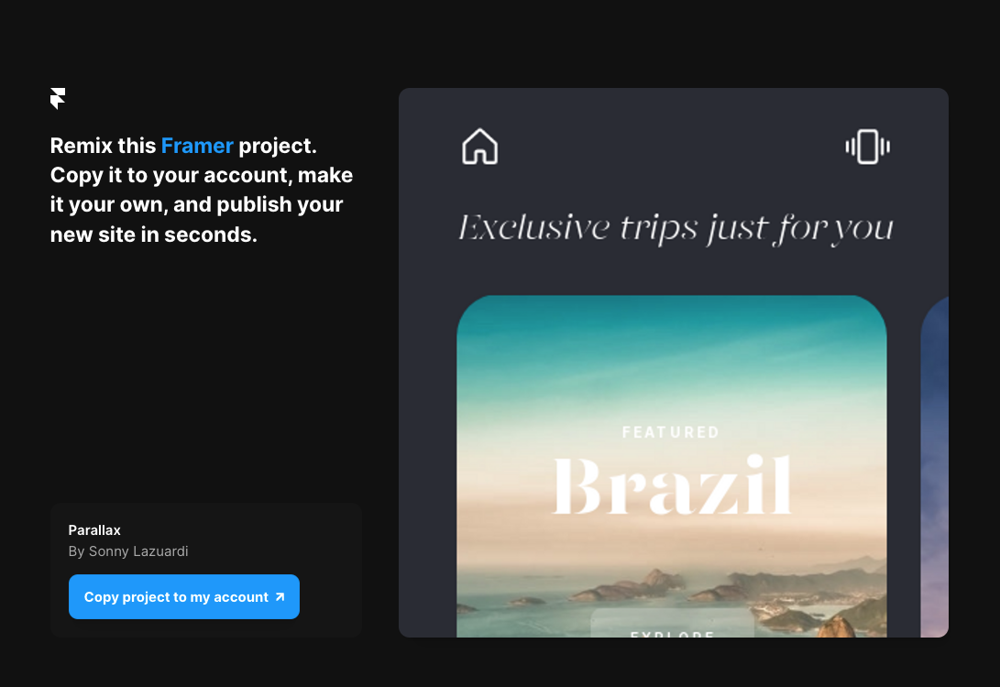

# Framer Parallax Cards

This is a website showcasing a parallax effect using the device orientation web api built using Framer.

https://user-images.githubusercontent.com/856609/178775837-c11e986a-db84-4708-9808-a84a63b0ac10.mp4

Inspired by this [Tweet](https://twitter.com/sbis04/status/1546572182146273280?s=20&t=Cac_P9mVv1-uoy0gaCJNQQ) and [Dribble](https://dribbble.com/shots/14330503--Parallax-Travel-Cards) ✨

## Clone Framer Website

[Remix](https://framer.com/projects/new?duplicate=ezy0qcFX1FuwVeX9mE9M) this framer website!
